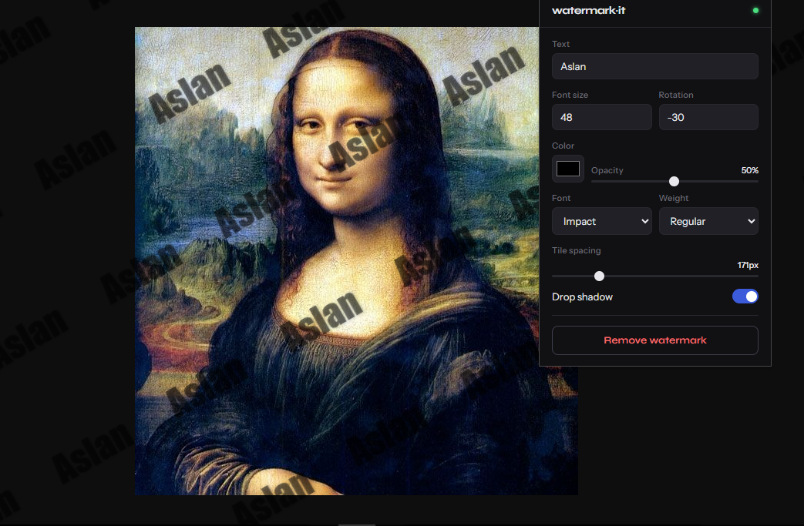

# WatermarkIt

A free, fully customizable browser extension for artists to watermark their art, right in the browser, in seconds.

---

## Installation

The extension is pre-packed and ready to go, no building or setup needed (Works on Chrome, Brave, Edge, Opera and any Chromium browser).

**Step 1**: Download `watermarkit.crx` from the [Releases](../../releases) page

**Step 2**, Open your browser and go to `[your-browser-name]://extensions`
(e.g. `chrome://extensions`, `brave://extensions`, `opera://extensions`, `edge://extensions`)

**Step 3**: Enable **Developer mode** using the toggle in the top-right corner

**Step 4**: Drag and drop the `.crx` file directly onto the extensions page

**Step 5**: Click **Add extension** on the prompt that appears

**Step 6**: Click **Approve extension** on the prompt that appears

The WatermarkIt extension will appear in your extensions tab. Click it on any tab to get started.

---

## How to Use

1. Open your artwork in a browser tab, just drag the image file into your browser
2. Click the **WatermarkIt** extension in your extensions tab
3. Customize your watermark text (your name, font size, color, spacing etc)
4. Adjust the settings to your liking
5. Watermark is live, screenshot or screen record away

Click **Remove watermark** to clear it instantly.

---

## Features

- **Custom text**: Your name, copyright notice, or any string
- **Full typography control**: Font family, weight, and size
- **Rotation**: Tile at any angle
- **Color & opacity**: Subtle blend or bold stamp
- **Tile spacing**: Control pattern density
- **Drop shadow**: Extra contrast on bright backgrounds
- **Live preview**: Changes apply instantly as you adjust settings
- **Auto-Save**: Settings are remembered between sessions, no need to readjust every time

---

## Settings Reference

| Setting | Description |
|---|---|
| Text | The watermark string tiled across the window |
| Font size | Text size in px |
| Rotation | Tilt angle (negative = counter-clockwise) |
| Color | Watermark text color |
| Opacity | Transparency level (0–100%) |
| Font | Typeface |
| Weight | Font weight (Regular, Bold, etc.) |
| Tile spacing | Gap between repeated instances in px |
| Drop shadow | Adds shadow for legibility on bright images |

---

## License
[Read License](LICENSE)

---

*Made for artists, by an artist.*
